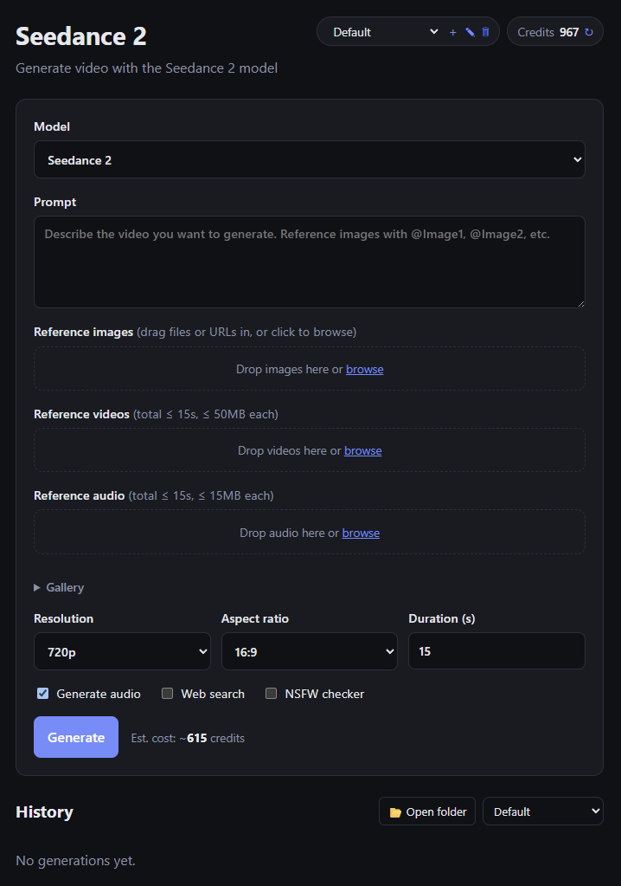

# Seedance 2 App

A tiny web app for generating with [kie.ai](https://kie.ai) models, switchable per
generation: **Seedance 2** / **Seedance 2 Fast** / **Seedance 2 Mini** (video; Fast
and Mini are 480p/720p only)
and **Seedream 5.0 Lite** image-to-image / text-to-image (the form adapts: quality
tier instead of resolution/duration, image references only — or none at all for
text-to-image — and results display as images).
A small Express server keeps your API key on the server side (never exposed to the
browser) and proxies requests to the kie.ai API. A single-page UI lets you submit a
prompt + reference media, then polls until the video is ready.



## Features

- **Drag-and-drop reference media** — images, videos, and audio each have a
  dropzone: drop local files (or click to browse, or drag a URL in). Files are
  saved locally on drop and only uploaded to kie.ai's file host when you click
  Generate. Each shows a thumbnail with an **×** to remove and a **Clear all**
  button.
- **Media gallery** — every dropped file is kept in a gallery (video/audio get a
  kind badge); expand it to click any past item back into the matching reference
  list. Hosting happens fresh at generate time, so kie.ai's ~3-day URL expiry
  never matters.
- **Labeled, reorderable references** — thumbnails are labeled `Image1`/`Video1`/
  `Audio1`, … matching the `@Image1`-style tokens you use in the prompt. Drag
  thumbnails to reorder within a list; the labels (and the order sent to the API)
  update accordingly.
- **Generation history** — every successful generation is saved to `history.json`
  with its prompt, settings, reference URLs, and measured credit cost. Each entry
  has **Re-import** (load the settings back into the form) and **Re-run** (load +
  generate again). Re-runs re-host the saved reference images automatically.
- **Saved videos** — finished videos are downloaded into the `video/` folder, and
  the history record links to both the local copy and the original URL.
- **Reload-safe** — the in-flight task id is saved to `localStorage`, so closing or
  reloading the tab mid-generation resumes polling automatically on the next load
  (generations can take 5+ minutes; nothing is held on an open connection).
- **Projects** — divide generations into projects via the header switcher (＋ new,
  ✎ rename, 🗑 delete). Each project gets its own `images/<slug>/` and
  `video/<slug>/` subfolders; the gallery is strictly per-project and history can
  be filtered by project (or All). Re-running another project's generation warns
  before saving the result to the active project. Deleting a project moves its
  media and history to Default. Pre-project data is auto-migrated to Default on
  first start.
- **Live credit balance** — shown in the header (`GET /api/v1/chat/credit`), with a
  refresh button.
- **Cost estimate** — kie.ai has no price-preview API, so cost is *measured*: the
  exact `creditsConsumed` reported by the task-detail API (falling back to the
  credit-balance delta around the run) is stored in history. The estimate next to
  the Generate button is seeded from known per-second rates (480p ≈ 19 credits/s,
  720p ≈ 41 credits/s, audio on) and refines itself from your measured runs per
  resolution + audio setting. Reference videos appear to bill by the combined
  input + output duration, so their measured lengths are added to the estimate
  (with a warning if they exceed the 15s total input limit).

## Setup

> **New to git, Node, or the terminal?** Follow the step-by-step
> [beginner's install guide](INSTALL.md) instead — no prior knowledge needed.

You'll need [Node.js](https://nodejs.org) 18+ (uses the built-in `fetch`).

```bash
# 1. Install dependencies
npm install

# 2. Add your API key
cp .env.example .env        # on Windows: copy .env.example .env
#   then edit .env and paste your key from https://kie.ai/api-key

# 3. Run it
npm start
```

Open <http://localhost:3000> in your browser.

For auto-restart while developing: `npm run dev`.

## Getting an API key

1. Go to <https://kie.ai/api-key>
2. Create a key and copy it into `.env` as `KIE_API_KEY=...`

**Each person running the app needs their own key.** Generations are billed to the
key's account.

## Security / sharing notes

- **Never commit `.env`.** It holds your secret API key and is listed in
  `.gitignore`. Only `.env.example` (a key-less template) is tracked.
- If you deploy this somewhere public, anyone who can reach the URL can spend your
  API credits, since the key lives on the server. Keep it local or behind auth.

## How it works

| Endpoint | What it does |
| --- | --- |
| `POST /api/create` | Builds the `bytedance/seedance-2` payload and calls `createTask`. |
| `GET /api/status?taskId=...` | Proxies `recordInfo` so the UI can poll for the result. |
| `GET /api/credits` | Proxies the account credit balance. |
| `GET/POST /api/projects`, `PUT/DELETE /api/projects/:id` | Project CRUD; delete moves contents to Default. |
| `POST /api/upload` | Saves dropped media (image/video/audio) to `images/` locally — no API call. |
| `POST /api/reupload` | Hosts a saved local file (by id) on kie.ai at generate time; returns a fresh URL. |
| `GET /api/images` | Lists the saved media gallery. |
| `DELETE /api/images/:id` | Removes an item from the gallery. |
| `POST /api/save` | Downloads the finished video into `video/` and appends the record (incl. measured cost) to `history.json`. |
| `GET /api/history` | Returns the saved generation history. |

The browser never sees `KIE_API_KEY` — it only talks to this local server.

## Project layout

```
server.js          Express proxy (holds the API key)
public/index.html  UI
public/style.css   styling
public/app.js      form handling, image upload, polling, history
.env.example       template — copy to .env and add your key
video/<project>/   downloaded result videos (git-ignored, created at runtime)
images/<project>/  saved reference media — images/video/audio (git-ignored, created at runtime)
history.json       generation history (git-ignored, created at runtime)
images.json        saved-media gallery manifest (git-ignored, created at runtime)
projects.json      project list (git-ignored, created at runtime)
```

## License & Disclaimer

This project is licensed under the [MIT License](LICENSE). In plain English:

**This software is provided "as is", without warranty of any kind, and you use
it entirely at your own risk.** By downloading or running it you accept that
the author is **not responsible or liable** for:

- any damage to your computer, files, or data;
- any charges, credit consumption, or costs incurred on your kie.ai account
  (every generation spends real credits — the cost estimates shown in the app
  are approximations, not guarantees);
- anything you create, generate, publish, or otherwise do with this software
  or its outputs — that's on you, including complying with kie.ai's and
  ByteDance's terms of service and the laws that apply to you;
- the safekeeping of your API key. Your key is stored in a local `.env` file
  and sent only to kie.ai. If you commit it, share it, screenshot it, paste it
  somewhere public, or otherwise leak it, anyone who has it can spend your
  credits. Guard it accordingly.

This is an unofficial hobby tool. It is **not affiliated with, endorsed by, or
supported by kie.ai or ByteDance**. Their APIs, models, pricing, and terms can
change at any time and break this app without notice.
